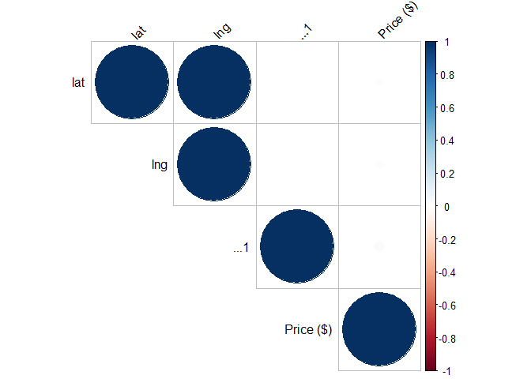
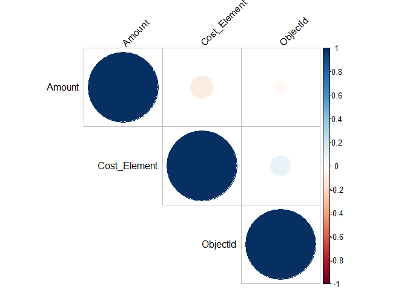
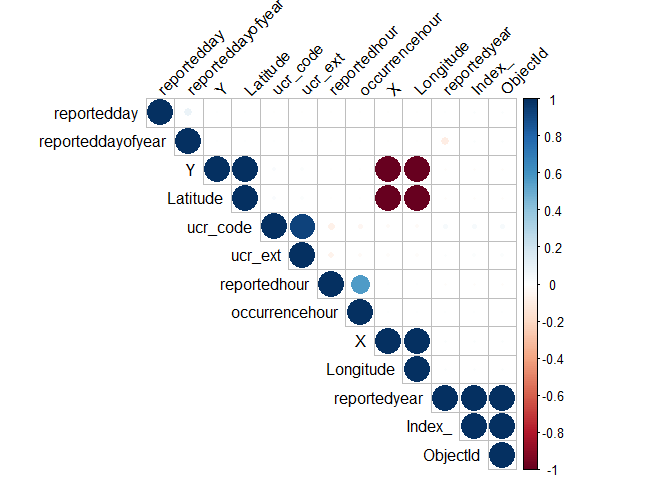
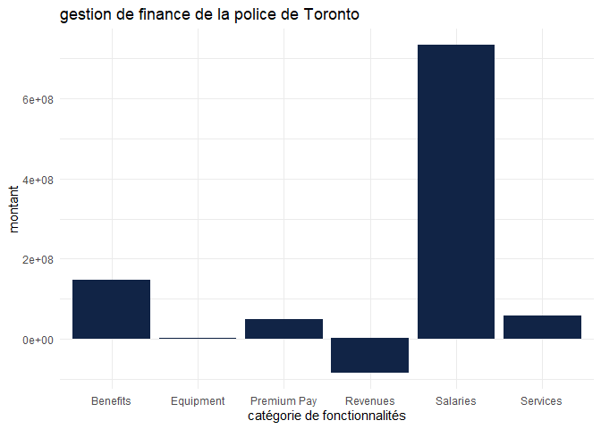
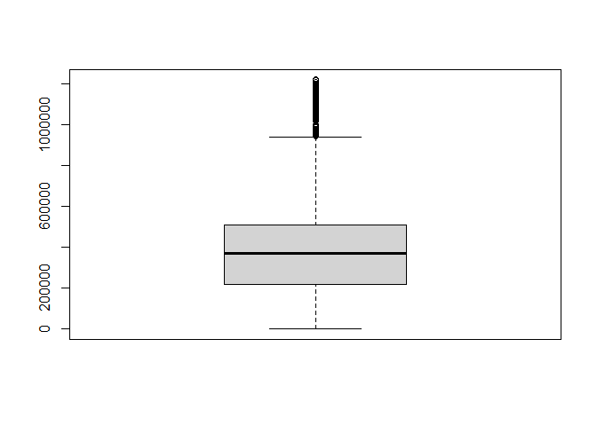
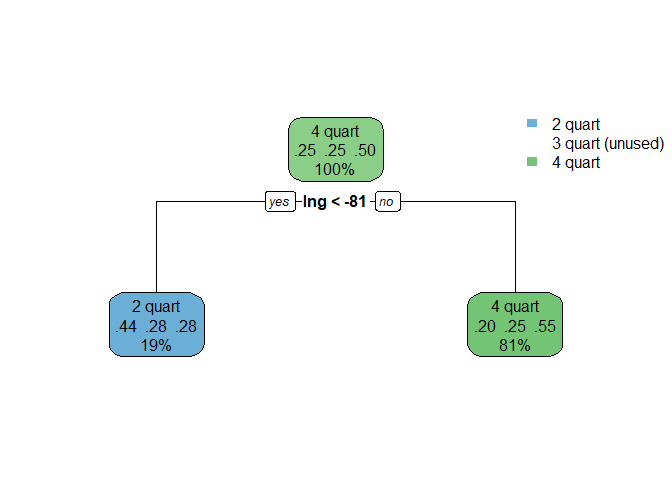

TP1 - Criminalité à Toronto
================
groupe B - Alexandre DAVY - Louis LIARD - Adrien SAVOYES - Louis
SELLIER - Karamoko Alpha DIALLO - Paul ZANON

### Chargement librairies

``` r
library(tidyverse) 
library(dsbox) 
library(corrplot)
```

    ## Warning: package 'corrplot' was built under R version 4.2.2

``` r
library(dplyr)
library(readxl)
library(outliers)
library(ggplot2)
library(tidyr)
library(plotly)
```

    ## Warning: package 'plotly' was built under R version 4.2.2

``` r
library(treemap)
```

    ## Warning: package 'treemap' was built under R version 4.2.2

``` r
library(RColorBrewer)
library(ggmap)
```

    ## Warning: package 'ggmap' was built under R version 4.2.2

``` r
library(rpart)
library(rpart.plot)
```

    ## Warning: package 'rpart.plot' was built under R version 4.2.3

### Chargement datasets

``` r
budget <- read_csv("data/Budget_2022.csv")
Major_Crime <- read_csv("data/Major_Crime_Indicators.csv")
properties <- read_csv("data/properties.csv")
```

### Résummer des données

``` r
my_summary <- function(x) {
  if(is.character(x) == TRUE)
  {
    uniqv <- unique(x)
    output1 = uniqv[which.max(tabulate(match(x, uniqv)))]
    names(output1) <- "mode"
    output2 = table(x)[output1]/length(x)
    names(output2) <- "freq"
    
    y <- x[x!=output1]
    uniqv <- unique(y)
    output3 = uniqv[which.max(tabulate(match(y, uniqv)))]
    names(output3) <- "mode 2"
    output4 = table(y)[output3]/length(x)
    names(output4) <- "freq 2"
    
    if(!is.na(output3))
    {
      return(c(output1,output2,output3,output4))
    }
    return(c(output1,output2))
  }
  if(is.numeric(x) == TRUE)
  {
    output1 <- summary(x)
    output2 <- sd(x)
    names(output2) <- "Ecart type"
    if(is.na(output2))
    {
        return(c(output1, output2))
    }
    output3 <- quantile(x)[4] - quantile(x)[2]
    names(output3) <- "IQR"
    
    output4 <- range(x)[2] - range(x)[1]
    names(output4) <- "Etendue"
    
    output5 <- var(x)
    names(output5) <- "Variance"
    
    output6 <- output2 / mean(x)
    names(output6) <- "coeficient de variation"
    
    return(c(output1, output2, output3,output4, output5, output6))
  }
  }
```

``` r
sapply(budget,my_summary)
```

    ## $Fiscal_Year
    ##                    Min.                 1st Qu.                  Median 
    ##                    2022                    2022                    2022 
    ##                    Mean                 3rd Qu.                    Max. 
    ##                    2022                    2022                    2022 
    ##              Ecart type                     IQR                 Etendue 
    ##                       0                       0                       0 
    ##                Variance coeficient de variation 
    ##                       0                       0 
    ## 
    ## $Budget_Type
    ##              mode              freq 
    ## "Approved Budget"               "1" 
    ## 
    ## $Organization_Entity
    ##                         mode                         freq 
    ## "1 - Toronto Police Service"          "0.971936694403655" 
    ##                       mode 2                       freq 2 
    ##    "3 - Parking Enforcement"         "0.0199053679229891" 
    ## 
    ## $Command_Name
    ##                                       mode 
    ##       "Community Safety Command (Command)" 
    ##                                       freq 
    ##                         "0.30347528144885" 
    ##                                     mode 2 
    ## "Specialized Operations Command (Command)" 
    ##                                     freq 2 
    ##                        "0.159895578397781" 
    ## 
    ## $Pillar_Name
    ##                          mode                          freq 
    ## "East Field Command (Pillar)"           "0.115516397454723" 
    ##                        mode 2                        freq 2 
    ## "West Field Command (Pillar)"           "0.112905857399249" 
    ## 
    ## $District_Name
    ##                              mode                              freq 
    ##                "People & Culture"              "0.0822320117474303" 
    ##                            mode 2                            freq 2 
    ## "Information Technology Services"              "0.0510686898352097" 
    ## 
    ## $Unit_Name
    ##                           mode                           freq 
    ##  "Centralized Service Charges"           "0.0267580355686083" 
    ##                         mode 2                         freq 2 
    ## "Detective Ops (CONFIDENTIAL)"           "0.0172948278675151" 
    ## 
    ## $Feature_Category
    ##                mode                freq              mode 2              freq 2 
    ##          "Services" "0.325501713166911"          "Salaries" "0.190406265296133" 
    ## 
    ## $Cost_Element
    ##                    Min.                 1st Qu.                  Median 
    ##            1.501000e+03            1.578000e+03            2.082000e+03 
    ##                    Mean                 3rd Qu.                    Max. 
    ##            3.094035e+03            4.312000e+03            9.453000e+03 
    ##              Ecart type                     IQR                 Etendue 
    ##            1.754408e+03            2.734000e+03            7.952000e+03 
    ##                Variance coeficient de variation 
    ##            3.077946e+06            5.670291e-01 
    ## 
    ## $Cost_Element_Long_Name
    ##                   mode                   freq                 mode 2 
    ## "Computers - hardware"   "0.0231685429923315" "Computers - software" 
    ##                 freq 2 
    ##   "0.0231685429923315" 
    ## 
    ## $Amount
    ##                    Min.                 1st Qu.                  Median 
    ##           -4.381020e+07            0.000000e+00            0.000000e+00 
    ##                    Mean                 3rd Qu.                    Max. 
    ##            1.910661e+05            3.400000e+03            5.716110e+07 
    ##              Ecart type                     IQR                 Etendue 
    ##            2.049826e+06            3.400000e+03            1.009713e+08 
    ##                Variance coeficient de variation 
    ##            4.201786e+12            1.072836e+01 
    ## 
    ## $ObjectId
    ##                    Min.                 1st Qu.                  Median 
    ##            1.000000e+00            1.533000e+03            3.065000e+03 
    ##                    Mean                 3rd Qu.                    Max. 
    ##            3.065000e+03            4.597000e+03            6.129000e+03 
    ##              Ecart type                     IQR                 Etendue 
    ##            1.769434e+03            3.064000e+03            6.128000e+03 
    ##                Variance coeficient de variation 
    ##            3.130898e+06            5.773032e-01

``` r
sapply(Major_Crime,my_summary)
```

    ## $X
    ##                    Min.                 1st Qu.                  Median 
    ##           -8.910331e+06           -8.846681e+06           -8.838015e+06 
    ##                    Mean                 3rd Qu.                    Max. 
    ##           -8.724562e+06           -8.829868e+06            0.000000e+00 
    ##              Ecart type                     IQR                 Etendue 
    ##            9.966746e+05            1.681260e+04            8.910331e+06 
    ##                Variance coeficient de variation 
    ##            9.933602e+11           -1.142378e-01 
    ## 
    ## $Y
    ##                    Min.                 1st Qu.                  Median 
    ##            0.000000e+00            5.412946e+06            5.419000e+06 
    ##                    Mean                 3rd Qu.                    Max. 
    ##            5.350375e+06            5.426986e+06            5.517228e+06 
    ##              Ecart type                     IQR                 Etendue 
    ##            6.112283e+05            1.403951e+04            5.517228e+06 
    ##                Variance coeficient de variation 
    ##            3.736000e+11            1.142403e-01 
    ## 
    ## $Index_
    ##                    Min.                 1st Qu.                  Median 
    ##            1.000000e+00            7.530900e+04            1.506170e+05 
    ##                    Mean                 3rd Qu.                    Max. 
    ##            1.506170e+05            2.259250e+05            3.012330e+05 
    ##              Ecart type                     IQR                 Etendue 
    ##            8.695862e+04            1.506160e+05            3.012320e+05 
    ##                Variance coeficient de variation 
    ##            7.561802e+09            5.773493e-01 
    ## 
    ## $event_unique_id
    ##                   mode                   freq                 mode 2 
    ##       "GO-20151785704" "7.96725458366115e-05"         "GO-201967831" 
    ##                 freq 2 
    ## "7.63528564267527e-05" 
    ## 
    ## $Division
    ##                 mode                 freq               mode 2 
    ##                "D51" "0.0855948717437996"                "D32" 
    ##               freq 2 
    ## "0.0759080180458316" 
    ## 
    ## $occurrencedate
    ##                     mode                     freq                   mode 2 
    ## "2018/01/01 05:00:00+00"   "0.000902955519481597" "2015/01/01 05:00:00+00" 
    ##                   freq 2 
    ##   "0.000856479867743574" 
    ## 
    ## $reporteddate
    ##                     mode                     freq                   mode 2 
    ## "2019/07/23 04:00:00+00"   "0.000557707820856281" "2019/11/18 05:00:00+00" 
    ##                   freq 2 
    ##   "0.000541109373806987" 
    ## 
    ## $location_type
    ##                                                  mode 
    ##                    "Apartment (Rooming House, Condo)" 
    ##                                                  freq 
    ##                                   "0.239220138563836" 
    ##                                                mode 2 
    ## "Single Home, House (Attach Garage, Cottage, Mobile)" 
    ##                                                freq 2 
    ##                                   "0.179515524527525" 
    ## 
    ## $premises_type
    ##                mode                freq              mode 2              freq 2 
    ##           "Outside" "0.265837408252084"         "Apartment" "0.239220138563836" 
    ## 
    ## $ucr_code
    ##                    Min.                 1st Qu.                  Median 
    ##            1.410000e+03            1.430000e+03            1.450000e+03 
    ##                    Mean                 3rd Qu.                    Max. 
    ##            1.702423e+03            2.120000e+03            2.135000e+03 
    ##              Ecart type                     IQR                 Etendue 
    ##            3.262601e+02            6.900000e+02            7.250000e+02 
    ##                Variance coeficient de variation 
    ##            1.064457e+05            1.916446e-01 
    ## 
    ## $ucr_ext
    ##                    Min.                 1st Qu.                  Median 
    ##             100.0000000             100.0000000             100.0000000 
    ##                    Mean                 3rd Qu.                    Max. 
    ##             146.5655854             200.0000000             230.0000000 
    ##              Ecart type                     IQR                 Etendue 
    ##              51.9889665             100.0000000             130.0000000 
    ##                Variance coeficient de variation 
    ##            2702.8526402               0.3547147 
    ## 
    ## $offence
    ##                mode                freq              mode 2              freq 2 
    ##           "Assault" "0.366918631092875"               "B&E" "0.166588653965535" 
    ## 
    ## $reportedyear
    ##                    Min.                 1st Qu.                  Median 
    ##            2.014000e+03            2.016000e+03            2.018000e+03 
    ##                    Mean                 3rd Qu.                    Max. 
    ##            2.017877e+03            2.020000e+03            2.022000e+03 
    ##              Ecart type                     IQR                 Etendue 
    ##            2.436940e+00            4.000000e+00            8.000000e+00 
    ##                Variance coeficient de variation 
    ##            5.938676e+00            1.207675e-03 
    ## 
    ## $reportedmonth
    ##                 mode                 freq               mode 2 
    ##                "May" "0.0919421178954497"               "June" 
    ##               freq 2 
    ## "0.0910756789594765" 
    ## 
    ## $reportedday
    ##                    Min.                 1st Qu.                  Median 
    ##                1.000000                8.000000               16.000000 
    ##                    Mean                 3rd Qu.                    Max. 
    ##               15.736659               23.000000               31.000000 
    ##              Ecart type                     IQR                 Etendue 
    ##                8.766766               15.000000               30.000000 
    ##                Variance coeficient de variation 
    ##               76.856194                0.557092 
    ## 
    ## $reporteddayofyear
    ##                    Min.                 1st Qu.                  Median 
    ##            1.000000e+00            9.200000e+01            1.780000e+02 
    ##                    Mean                 3rd Qu.                    Max. 
    ##            1.807658e+02            2.700000e+02            3.660000e+02 
    ##              Ecart type                     IQR                 Etendue 
    ##            1.037172e+02            1.780000e+02            3.650000e+02 
    ##                Variance coeficient de variation 
    ##            1.075726e+04            5.737659e-01 
    ## 
    ## $reporteddayofweek
    ##                mode                freq              mode 2              freq 2 
    ##            "Monday" "0.147862286004521"            "Friday" "0.146152645958444" 
    ## 
    ## $reportedhour
    ##                    Min.                 1st Qu.                  Median 
    ##               0.0000000               8.0000000              13.0000000 
    ##                    Mean                 3rd Qu.                    Max. 
    ##              12.8087859              18.0000000              23.0000000 
    ##              Ecart type                     IQR                 Etendue 
    ##               6.5025623              10.0000000              23.0000000 
    ##                Variance coeficient de variation 
    ##              42.2833167               0.5076642 
    ## 
    ## $occurrenceyear
    ##       Min.    1st Qu.     Median       Mean    3rd Qu.       Max.       NA's 
    ##   2000.000   2016.000   2018.000   2017.823   2020.000   2022.000    100.000 
    ## Ecart type 
    ##         NA 
    ## 
    ## $occurrencemonth
    ##                 mode                 freq               mode 2 
    ##               "June"  "0.091205146846461"                "May" 
    ##               freq 2 
    ## "0.0911918680888216" 
    ## 
    ## $occurrenceday
    ##       Min.    1st Qu.     Median       Mean    3rd Qu.       Max.       NA's 
    ##    1.00000    8.00000   15.00000   15.45648   23.00000   31.00000  100.00000 
    ## Ecart type 
    ##         NA 
    ## 
    ## $occurrencedayofyear
    ##       Min.    1st Qu.     Median       Mean    3rd Qu.       Max.       NA's 
    ##     1.0000    92.0000   178.0000   180.5448   270.0000   366.0000   100.0000 
    ## Ecart type 
    ##         NA 
    ## 
    ## $occurrencedayofweek
    ##                mode                freq              mode 2              freq 2 
    ##            "Friday" "0.151148778520282"          "Saturday" "0.148220812460786" 
    ## 
    ## $occurrencehour
    ##                    Min.                 1st Qu.                  Median 
    ##               0.0000000               7.0000000              14.0000000 
    ##                    Mean                 3rd Qu.                    Max. 
    ##              12.6015908              19.0000000              23.0000000 
    ##              Ecart type                     IQR                 Etendue 
    ##               7.2437527              12.0000000              23.0000000 
    ##                Variance coeficient de variation 
    ##              52.4719529               0.5748284 
    ## 
    ## $mci_category
    ##                mode                freq              mode 2              freq 2 
    ##           "Assault" "0.537235296265681"   "Break and Enter" "0.197322338522008" 
    ## 
    ## $Hood_ID
    ##                 mode                 freq               mode 2 
    ##                 "77" "0.0375191297102243"                 "75" 
    ##               freq 2 
    ## "0.0330043521128163" 
    ## 
    ## $Neighbourhood
    ##                                mode                                freq 
    ## "Waterfront Communities-The Island"                "0.0375191297102243" 
    ##                              mode 2                              freq 2 
    ##             "Church-Yonge Corridor"                "0.0330043521128163" 
    ## 
    ## $Longitude
    ##                    Min.                 1st Qu.                  Median 
    ##             -80.0428663             -79.4710859             -79.3932382 
    ##                    Mean                 3rd Qu.                    Max. 
    ##             -78.3740712             -79.3200558               0.0000000 
    ##              Ecart type                     IQR                 Etendue 
    ##               8.9532798               0.1510301              80.0428663 
    ##                Variance coeficient de variation 
    ##              80.1612199              -0.1142378 
    ## 
    ## $Latitude
    ##                    Min.                 1st Qu.                  Median 
    ##              0.00000000             43.65980581             43.69913160 
    ##                    Mean                 3rd Qu.                    Max. 
    ##             43.14387406             43.75097753             44.33369129 
    ##              Ecart type                     IQR                 Etendue 
    ##              4.92861266              0.09117172             44.33369129 
    ##                Variance coeficient de variation 
    ##             24.29122275              0.11423667 
    ## 
    ## $ObjectId
    ##                    Min.                 1st Qu.                  Median 
    ##            1.000000e+00            7.530900e+04            1.506170e+05 
    ##                    Mean                 3rd Qu.                    Max. 
    ##            1.506170e+05            2.259250e+05            3.012330e+05 
    ##              Ecart type                     IQR                 Etendue 
    ##            8.695862e+04            1.506160e+05            3.012320e+05 
    ##                Variance coeficient de variation 
    ##            7.561802e+09            5.773493e-01

``` r
sapply(properties,my_summary)
```

    ## $...1
    ##                    Min.                 1st Qu.                  Median 
    ##            0.000000e+00            1.994000e+04            3.403700e+04 
    ##                    Mean                 3rd Qu.                    Max. 
    ##            4.287852e+04            6.150150e+04            1.249290e+05 
    ##              Ecart type                     IQR                 Etendue 
    ##            3.145625e+04            4.156150e+04            1.249290e+05 
    ##                Variance coeficient de variation 
    ##            9.894955e+08            7.336132e-01 
    ## 
    ## $Address
    ##                              mode                              freq 
    ##     "223 Erb Street Waterloo, ON"            "0.000631138811092265" 
    ##                            mode 2                            freq 2 
    ## "311 Dundas Street Cambridge, ON"            "0.000433907932625932" 
    ## 
    ## $AreaName
    ##                 mode                 freq               mode 2 
    ##           "Downtown" "0.0327403258254112"        "Mississauga" 
    ##               freq 2 
    ## "0.0296635241213364" 
    ## 
    ## $`Price ($)`
    ##                    Min.                 1st Qu.                  Median 
    ##            0.000000e+00            2.199000e+05            3.719000e+05 
    ##                    Mean                 3rd Qu.                    Max. 
    ##            5.645438e+05            6.199000e+05            3.250000e+07 
    ##              Ecart type                     IQR                 Etendue 
    ##            8.475962e+05            4.000000e+05            3.250000e+07 
    ##                Variance coeficient de variation 
    ##            7.184193e+11            1.501383e+00 
    ## 
    ## $lat
    ##                    Min.                 1st Qu.                  Median 
    ##             -999.000000               43.401087               43.715977 
    ##                    Mean                 3rd Qu.                    Max. 
    ##               37.326614               44.466711               53.851017 
    ##              Ecart type                     IQR                 Etendue 
    ##               82.858347                1.065624             1052.851017 
    ##                Variance coeficient de variation 
    ##             6865.505690                2.219820 
    ## 
    ## $lng
    ##                    Min.                 1st Qu.                  Median 
    ##            -999.0000000             -80.3081590             -79.5033420 
    ##                    Mean                 3rd Qu.                    Max. 
    ##             -85.2183791             -79.1073265               1.0745190 
    ##              Ecart type                     IQR                 Etendue 
    ##              73.0935722               1.2008325            1000.0745190 
    ##                Variance coeficient de variation 
    ##            5342.6703017              -0.8577208

``` r
select_numeric_cols <- function(df) {
  numeric_cols <- sapply(df, is.numeric) # Détermine les colonnes numériques
  df_numeric <- df[, numeric_cols] # Sélectionne les colonnes numériques
  return(df_numeric) # Retourne le dataframe avec les colonnes numériques uniquement
}
```

``` r
propertie_num <- select_numeric_cols(properties)
print(propertie_num)
```

    ## # A tibble: 25,351 × 4
    ##     ...1 `Price ($)`   lat   lng
    ##    <dbl>       <dbl> <dbl> <dbl>
    ##  1     0      999888  43.7 -79.5
    ##  2     1      399900  43.2 -79.9
    ##  3     2      479000  43.3 -79.9
    ##  4     3      285900  43.2 -79.8
    ##  5     6      362000  43.7 -79.4
    ##  6     7     1488000  43.7 -79.3
    ##  7     8          25  43.7 -79.5
    ##  8     9      254900  43.3 -79.9
    ##  9    10      364900  43.2 -79.9
    ## 10    12      304900  43.2 -79.8
    ## # … with 25,341 more rows

``` r
cor(propertie_num)
```

    ##                    ...1  Price ($)           lat         lng
    ## ...1       1.0000000000 0.02241174 -0.0003230475 -0.00218434
    ## Price ($)  0.0224117427 1.00000000  0.0119423894  0.01292994
    ## lat       -0.0003230475 0.01194239  1.0000000000  0.99960926
    ## lng       -0.0021843399 0.01292994  0.9996092577  1.00000000

``` r
cor_pro_num = cor(propertie_num)
```

``` r
corrplot(cor_pro_num, type = "upper", order = "hclust", tl.col = 'black', tl.srt = 45)
```

<!-- -->

``` r
budget_num <- select_numeric_cols(budget)
```

``` r
remove_variable <- function(data, var_name) {
  data[, var_name] <- NULL
  return(data)
}

budget_num2<- remove_variable(budget_num, "Fiscal_Year")
```

``` r
cor(budget_num2)
```

    ##              Cost_Element      Amount    ObjectId
    ## Cost_Element    1.0000000 -0.10893911  0.09189220
    ## Amount         -0.1089391  1.00000000 -0.03224158
    ## ObjectId        0.0918922 -0.03224158  1.00000000

``` r
cor_bud2_num = cor(budget_num2)
```

``` r
corrplot(cor_bud2_num, type = "upper", order = "hclust", tl.col = 'black', tl.srt = 45)
```

<!-- -->

``` r
Major_Crime_num <- select_numeric_cols(Major_Crime)
```

``` r
Major_Crime_num2<- remove_variable(Major_Crime_num, "occurrenceyear")
Major_Crime_num3<- remove_variable(Major_Crime_num2, "occurrenceday")
Major_Crime_num4<- remove_variable(Major_Crime_num3, "occurrencedayofyear")
```

``` r
cor(Major_Crime_num4)
```

    ##                              X            Y       Index_      ucr_code
    ## X                  1.000000000 -0.999790441  0.012188459 -0.0259913897
    ## Y                 -0.999790441  1.000000000 -0.012829881  0.0256110482
    ## Index_             0.012188459 -0.012829881  1.000000000  0.0356478706
    ## ucr_code          -0.025991390  0.025611048  0.035647871  1.0000000000
    ## ucr_ext           -0.019855096  0.019522198  0.019140561  0.9204898802
    ## reportedyear       0.012776850 -0.013409732  0.992881577  0.0343238358
    ## reportedday       -0.002564812  0.002578124  0.010293079 -0.0006646436
    ## reporteddayofyear -0.005550511  0.005523672  0.016778595  0.0023881891
    ## reportedhour       0.006849295 -0.005969796 -0.011112272 -0.0772506188
    ## occurrencehour     0.002730976 -0.002246185  0.006039805 -0.0410911782
    ## Longitude          1.000000000 -0.999790441  0.012188459 -0.0259913897
    ## Latitude          -0.999832102  0.999996615 -0.012767149  0.0255049154
    ## ObjectId           0.012188608 -0.012830036  0.999989399  0.0356394676
    ##                        ucr_ext  reportedyear   reportedday reporteddayofyear
    ## X                 -0.019855096  0.0127768504 -0.0025648116      -0.005550511
    ## Y                  0.019522198 -0.0134097322  0.0025781242       0.005523672
    ## Index_             0.019140561  0.9928815768  0.0102930793       0.016778595
    ## ucr_code           0.920489880  0.0343238358 -0.0006646436       0.002388189
    ## ucr_ext            1.000000000  0.0181347489 -0.0014862173       0.001658966
    ## reportedyear       0.018134749  1.0000000000  0.0000919956      -0.099195067
    ## reportedday       -0.001486217  0.0000919956  1.0000000000       0.088157921
    ## reporteddayofyear  0.001658966 -0.0991950670  0.0881579211       1.000000000
    ## reportedhour      -0.062726136 -0.0105469905 -0.0019201097      -0.004991329
    ## occurrencehour    -0.022445011  0.0054540182 -0.0015096877       0.003729766
    ## Longitude         -0.019855096  0.0127768504 -0.0025648116      -0.005550511
    ## Latitude           0.019417461 -0.0133473053  0.0025791826       0.005523256
    ## ObjectId           0.019128534  0.9928696288  0.0102545769       0.016789622
    ##                   reportedhour occurrencehour    Longitude     Latitude
    ## X                  0.006849295    0.002730976  1.000000000 -0.999832102
    ## Y                 -0.005969796   -0.002246185 -0.999790441  0.999996615
    ## Index_            -0.011112272    0.006039805  0.012188459 -0.012767149
    ## ucr_code          -0.077250619   -0.041091178 -0.025991390  0.025504915
    ## ucr_ext           -0.062726136   -0.022445011 -0.019855096  0.019417461
    ## reportedyear      -0.010546991    0.005454018  0.012776850 -0.013347305
    ## reportedday       -0.001920110   -0.001509688 -0.002564812  0.002579183
    ## reporteddayofyear -0.004991329    0.003729766 -0.005550511  0.005523256
    ## reportedhour       1.000000000    0.564409654  0.006849295 -0.006090994
    ## occurrencehour     0.564409654    1.000000000  0.002730976 -0.002364204
    ## Longitude          0.006849295    0.002730976  1.000000000 -0.999832102
    ## Latitude          -0.006090994   -0.002364204 -0.999832102  1.000000000
    ## ObjectId          -0.011147915    0.006029707  0.012188608 -0.012767292
    ##                       ObjectId
    ## X                  0.012188608
    ## Y                 -0.012830036
    ## Index_             0.999989399
    ## ucr_code           0.035639468
    ## ucr_ext            0.019128534
    ## reportedyear       0.992869629
    ## reportedday        0.010254577
    ## reporteddayofyear  0.016789622
    ## reportedhour      -0.011147915
    ## occurrencehour     0.006029707
    ## Longitude          0.012188608
    ## Latitude          -0.012767292
    ## ObjectId           1.000000000

``` r
cor_maj4_num = cor(Major_Crime_num4)
```

``` r
corrplot(cor_maj4_num, type = "upper", order = "hclust", tl.col = 'black', tl.srt = 45)
```

<!-- -->

### Balayage des données

On regarde la présence d’outliers pour la dataset properties

``` r
test <- grubbs.test(properties$`Price ($)`)
test
```

    ## 
    ##  Grubbs test for one outlier
    ## 
    ## data:  properties$`Price ($)`
    ## G = 37.678, U = 0.944, p-value < 2.2e-16
    ## alternative hypothesis: highest value 32500000 is an outlier

``` r
test <- grubbs.test(properties$`Price ($)`, opposite= TRUE)
test
```

    ## 
    ##  Grubbs test for one outlier
    ## 
    ## data:  properties$`Price ($)`
    ## G = 0.66605, U = 0.99998, p-value = 1
    ## alternative hypothesis: lowest value 0 is an outlier

Afin de vérifier s’ il y a ou non présence de données aberrantes pour la
base de données properties nous avons effectué le test de Grubbs pour le
maximum et le minimum. Pour le maximum qui ici est égale à 32 500 000 on
peut en conclure qu’ici ce n’est pas une donnée aberrante malgré le fait
que la valeur soit très élevée. En effet, cette base de données recense
le prix de l’immobilier et il est possible que certaines propriétés
soient très chères. Pour le minimum qui est de 0 dans ce cas la est une
donnée aberrante. En effet, dans le cas du prix d’une propriété il est
impossible que cette valeur soit égale a 0. De plus, il existe d’autres
valeurs très faibles qui peuvent nous faire penser à la présence
d’outliers. On peut donc en conclure que cette ligne est par conséquent
fausse est doit être rectifiée.

Un autre indicateur montrant la présence d’outliers est le graphique en
boîte à moustache. On peut voir ici par la présence de points noir
représentant des outliers. Il va donc falloir faire en sorte de les
supprimer afin d’avoir les données les plus lisses que possible.

``` r
boxplot(properties$`Price ($)`)
```

<!-- -->

``` r
mediane <- median(properties$`Price ($)`, na.rm=TRUE)
properties$`Price ($)` <- ifelse(properties$`Price ($)` > quantile(properties$`Price ($)`, 0.75) + 1.5 * IQR(properties$`Price ($)`) | properties$`Price ($)` < quantile(properties$`Price ($)`, 0.25) - 1.5 * IQR(properties$`Price ($)`), mediane, properties$`Price ($)`)
```

Pour cela on cherche les outliers et on les remplace par la médiane
qu’on a calculée à l’aide d’écart type. Après ça, on peut voir un
graphique en boîte à moustache plus cohérent. Il reste cependant quelque
point noir mais qui ne sont pas concidéré comme des outliers mais
uniquement des valeurs élevées.

``` r
boxplot(properties$`Price ($)`)
```

<!-- -->

Par la suite dans le dataset Major_Crime nous avons analysé toutes les
colonnes afin de faire apparaître la présence de données aberrantes.
Pour cela, nous avons sélectionné les colonnes principales dans
lesquelles des données aberrantes peuvent apparaître comme X,Y Mois,
Jours, Année, heures…

On peut voir que pour les colonnes X et Y il y a la présence de 0 ce qui
est impossible pour le cas des coordonnées. Nous avons donc supprimé
toutes les lignes dans le cas où un 0 apparaissait. Pour les restes des
colonnes aucune valeur aberrantes n’était présente.

``` r
table(Major_Crime$X)
table(Major_Crime$Y)
```

    ## 
    ##  2014  2015  2016  2017  2018  2019  2020  2021  2022 
    ## 32474 32897 33532 35148 37349 40107 35146 35058 19522

    ## 
    ##     April    August  December  February   January      July      June     March 
    ##     25301     25007     22620     23027     24959     25194     27435     25921 
    ##       May  November   October September 
    ##     27696     24508     25237     24328

    ## 
    ##     1     2     3     4     5     6     7     8     9    10    11    12    13 
    ##  9985  9716  9839  9823  9678  9719  9893  9784 10003  9889 10008  9869  9917 
    ##    14    15    16    17    18    19    20    21    22    23    24    25    26 
    ##  9904  9725 10028 10133 10257 10050 10160  9803 10142 10072  9891  9879  9698 
    ##    27    28    29    30    31 
    ##  9861  9879  8990  8919  5719

    ## 
    ##    Friday    Monday  Saturday    Sunday  Thursday   Tuesday Wednesday 
    ##     44026     44541     41649     41208     42993     43382     43434

    ## 
    ##     0     1     2     3     4     5     6     7     8     9    10    11    12 
    ## 10351  9670  9161  7721  6484  5520  7353 10002 12352 14236 14162 14536 15352 
    ##    13    14    15    16    17    18    19    20    21    22    23 
    ## 15561 15501 16194 15704 15312 15717 15286 14816 14472 13141 12629

    ## 
    ##                                       Apartment (Rooming House, Condo) 
    ##                                                                  72061 
    ##                Bank And Other Financial Institutions (Money Mart, Tsx) 
    ##                                                                   1789 
    ##                                                       Bar / Restaurant 
    ##                                                                  12031 
    ##                                                            Cargo Train 
    ##                                                                      8 
    ##      Commercial Dwelling Unit (Hotel, Motel, B & B, Short Term Rental) 
    ##                                                                   3454 
    ##                                                   Community Group Home 
    ##                                                                    214 
    ##                           Construction Site (Warehouse, Trailer, Shed) 
    ##                                                                   1834 
    ##                                                     Convenience Stores 
    ##                                                                   3851 
    ##                    Dealership (Car, Motorcycle, Marine, Trailer, Etc.) 
    ##                                                                   1520 
    ##                         Gas Station (Self, Full, Attached Convenience) 
    ##                                                                   1607 
    ##                                                                 Go Bus 
    ##                                                                     68 
    ##                                                             Go Station 
    ##                                                                    380 
    ##                                                               Go Train 
    ##                                                                     60 
    ##                 Group Homes (Non-Profit, Halfway House, Social Agency) 
    ##                                                                   1446 
    ##                                                          Halfway House 
    ##                                                                     37 
    ##                                             Homeless Shelter / Mission 
    ##                                                                   1966 
    ## Hospital / Institutions / Medical Facilities (Clinic, Dentist, Morgue) 
    ##                                                                   2660 
    ##                                              Jails / Detention Centres 
    ##                                                                   1891 
    ##                                                           Nursing Home 
    ##                                                                    694 
    ##                                      Open Areas (Lakes, Parks, Rivers) 
    ##                                                                   6278 
    ## Other Commercial / Corporate Places (For Profit, Warehouse, Corp. Bldg 
    ##                                                                  34774 
    ##  Other Non Commercial / Corporate Places (Non-Profit, Gov'T, Firehall) 
    ##                                                                   2556 
    ##                                                  Other Passenger Train 
    ##                                                                     32 
    ##                                          Other Passenger Train Station 
    ##                                                                     97 
    ##                                  Other Regional Transit System Vehicle 
    ##                                                                    100 
    ##                                  Other Train Admin Or Support Facility 
    ##                                                                     18 
    ##                                                     Other Train Tracks 
    ##                                                                     17 
    ##                                                       Other Train Yard 
    ##                                                                     19 
    ##                      Parking Lots (Apt., Commercial Or Non-Commercial) 
    ##                                                                  25322 
    ##                                                               Pharmacy 
    ##                                                                    719 
    ##                       Police / Courts (Parole Board, Probation Office) 
    ##                                                                    851 
    ##               Private Property Structure (Pool, Shed, Detached Garage) 
    ##                                                                   2743 
    ##              Religious Facilities (Synagogue, Church, Convent, Mosque) 
    ##                                                                    731 
    ##                                                        Retirement Home 
    ##                                                                    512 
    ##                                     Schools During Supervised Activity 
    ##                                                                   4567 
    ##                                  Schools During Un-Supervised Activity 
    ##                                                                   2650 
    ##                    Single Home, House (Attach Garage, Cottage, Mobile) 
    ##                                                                  54076 
    ##                  Streets, Roads, Highways (Bicycle Path, Private Road) 
    ##                                                                  47619 
    ##                                          Ttc Admin Or Support Facility 
    ##                                                                     35 
    ##                                                                Ttc Bus 
    ##                                                                   2644 
    ##                                                         Ttc Bus Garage 
    ##                                                                     31 
    ##                                          Ttc Bus Stop / Shelter / Loop 
    ##                                                                    841 
    ##                                         Ttc Light Rail Transit Station 
    ##                                                                     94 
    ##                                                 Ttc Light Rail Vehicle 
    ##                                                                     29 
    ##                                                         Ttc Street Car 
    ##                                                                    497 
    ##                                                     Ttc Subway Station 
    ##                                                                   3648 
    ##                                                       Ttc Subway Train 
    ##                                                                    837 
    ##                                     Ttc Subway Tunnel / Outdoor Tracks 
    ##                                                                     20 
    ##                                                    Ttc Support Vehicle 
    ##                                                                      2 
    ##                                                Ttc Wheel Trans Vehicle 
    ##                                                                     11 
    ##                                                Universities / Colleges 
    ##                                                                    549 
    ##                                                                Unknown 
    ##                                                                    743

``` r
Major_Crime <- Major_Crime[Major_Crime$ Y!=0,]
```

### Visualisation

\###Classification des types de criminalités des quartiers

\###ACP

\###ACm

\###AFC

\###Prédiction de la valeur foncières des maisons de la ville de Toronto

``` r
properties <- properties %>% mutate(
  ClassPrice = case_when(`Price ($)` < quantile(properties$`Price ($)`)[1] ~ '1 quart',
                         `Price ($)` < quantile(properties$`Price ($)`)[2] ~ '2 quart',
                         `Price ($)` < quantile(properties$`Price ($)`)[3] ~ '3 quart',
                      TRUE ~ '4 quart'))


properties <- properties %>% mutate(Price = (`Price ($)`+1)/(max(properties$`Price ($)`)-1))

properties <- properties %>% mutate(Price = `Price ($)`/max(properties$`Price ($)`))
```

\###regresion linéaire

\###regresion logistique

``` r
model <- glm( Price ~ lat + lng, data = properties, family = binomial)
```

    ## Warning in eval(family$initialize): non-integer #successes in a binomial glm!

``` r
model
```

    ## 
    ## Call:  glm(formula = Price ~ lat + lng, family = binomial, data = properties)
    ## 
    ## Coefficients:
    ## (Intercept)          lat          lng  
    ##     4.17446     -0.03676      0.04171  
    ## 
    ## Degrees of Freedom: 25350 Total (i.e. Null);  25348 Residual
    ## Null Deviance:       5228 
    ## Residual Deviance: 5192  AIC: 26100

``` r
coef(model)
```

    ## (Intercept)         lat         lng 
    ##  4.17445792 -0.03675969  0.04171392

``` r
summary(model)
```

    ## 
    ## Call:
    ## glm(formula = Price ~ lat + lng, family = binomial, data = properties)
    ## 
    ## Deviance Residuals: 
    ##      Min        1Q    Median        3Q       Max  
    ## -1.47483  -0.31496  -0.04156   0.20373   1.55514  
    ## 
    ## Coefficients:
    ##              Estimate Std. Error z value Pr(>|z|)    
    ## (Intercept)  4.174458   0.893231   4.673 2.96e-06 ***
    ## lat         -0.036760   0.006671  -5.511 3.58e-08 ***
    ## lng          0.041714   0.007562   5.516 3.47e-08 ***
    ## ---
    ## Signif. codes:  0 '***' 0.001 '**' 0.01 '*' 0.05 '.' 0.1 ' ' 1
    ## 
    ## (Dispersion parameter for binomial family taken to be 1)
    ## 
    ##     Null deviance: 5227.8  on 25350  degrees of freedom
    ## Residual deviance: 5192.2  on 25348  degrees of freedom
    ## AIC: 26097
    ## 
    ## Number of Fisher Scoring iterations: 4

``` r
confint(model)
```

    ## Waiting for profiling to be done...

    ## Warning in eval(family$initialize): non-integer #successes in a binomial glm!

    ## Warning in eval(family$initialize): non-integer #successes in a binomial glm!

    ## Warning in eval(family$initialize): non-integer #successes in a binomial glm!

    ## Warning in eval(family$initialize): non-integer #successes in a binomial glm!

    ## Warning in eval(family$initialize): non-integer #successes in a binomial glm!

    ## Warning in eval(family$initialize): non-integer #successes in a binomial glm!

    ## Warning in eval(family$initialize): non-integer #successes in a binomial glm!

    ## Warning in eval(family$initialize): non-integer #successes in a binomial glm!

    ## Warning in eval(family$initialize): non-integer #successes in a binomial glm!

    ## Warning in eval(family$initialize): non-integer #successes in a binomial glm!

    ## Warning in eval(family$initialize): non-integer #successes in a binomial glm!

    ## Warning in eval(family$initialize): non-integer #successes in a binomial glm!

    ## Warning in eval(family$initialize): non-integer #successes in a binomial glm!

    ## Warning in eval(family$initialize): non-integer #successes in a binomial glm!

    ## Warning in eval(family$initialize): non-integer #successes in a binomial glm!

    ## Warning in eval(family$initialize): non-integer #successes in a binomial glm!

    ## Warning in eval(family$initialize): non-integer #successes in a binomial glm!

    ## Warning in eval(family$initialize): non-integer #successes in a binomial glm!

    ## Warning in eval(family$initialize): non-integer #successes in a binomial glm!

    ## Warning in eval(family$initialize): non-integer #successes in a binomial glm!

    ## Warning in eval(family$initialize): non-integer #successes in a binomial glm!

    ## Warning in eval(family$initialize): non-integer #successes in a binomial glm!

    ## Warning in eval(family$initialize): non-integer #successes in a binomial glm!

    ## Warning in eval(family$initialize): non-integer #successes in a binomial glm!

    ## Warning in eval(family$initialize): non-integer #successes in a binomial glm!

    ## Warning in eval(family$initialize): non-integer #successes in a binomial glm!

    ## Warning in eval(family$initialize): non-integer #successes in a binomial glm!

    ## Warning in eval(family$initialize): non-integer #successes in a binomial glm!

    ## Warning in eval(family$initialize): non-integer #successes in a binomial glm!

    ## Warning in eval(family$initialize): non-integer #successes in a binomial glm!

    ## Warning in eval(family$initialize): non-integer #successes in a binomial glm!

    ## Warning in eval(family$initialize): non-integer #successes in a binomial glm!

    ## Warning in eval(family$initialize): non-integer #successes in a binomial glm!

    ##                   2.5 %      97.5 %
    ## (Intercept)  2.47280123  5.96887817
    ## lat         -0.05016137 -0.02405169
    ## lng          0.02730779  0.05690706

``` r
properties$fitted = fitted(model) * max(properties$`Price ($)`)
head(properties$fitted)
```

    ##        1        2        3        4        5        6 
    ## 391266.0 391473.2 391290.9 393217.0 393498.9 393592.8

\###arbre de décision

``` r
model1 <- rpart(ClassPrice ~ lat + lng, data = properties, method = "class",
                control = rpart.control(cp = 0.02))

rpart.plot(model1)
```

<!-- -->

``` r
data.predict = properties[c(1:10), ]

pred <- predict(model1, 
                newdata=data.predict, type = "class")
pred
```

    ##       1       2       3       4       5       6       7       8       9      10 
    ## 4 quart 4 quart 4 quart 4 quart 4 quart 4 quart 4 quart 4 quart 4 quart 4 quart 
    ## Levels: 2 quart 3 quart 4 quart
